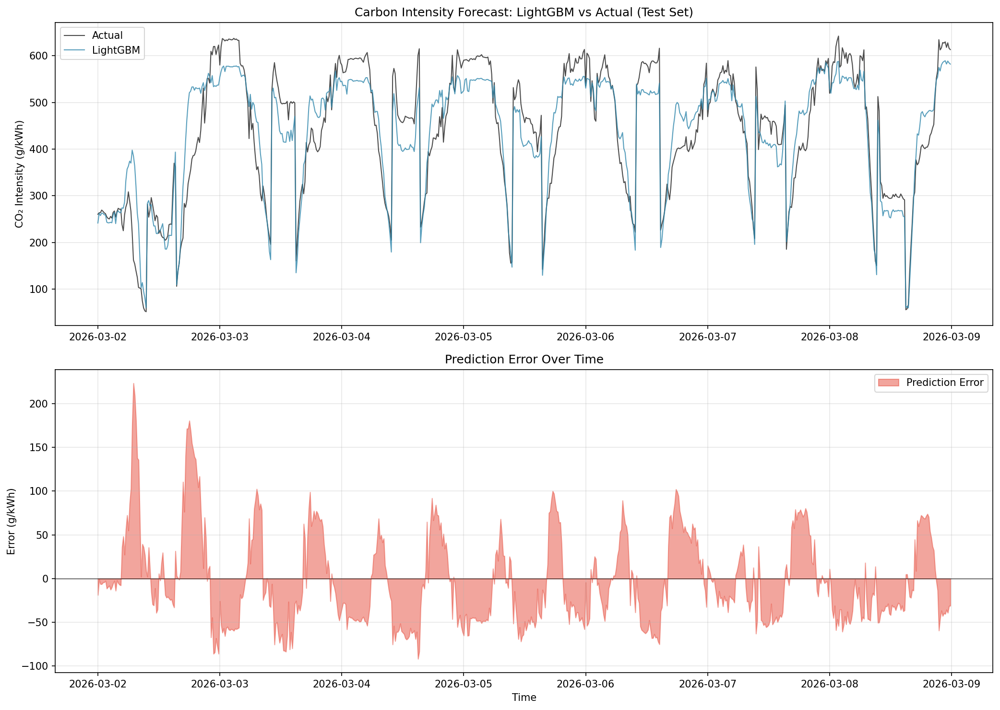
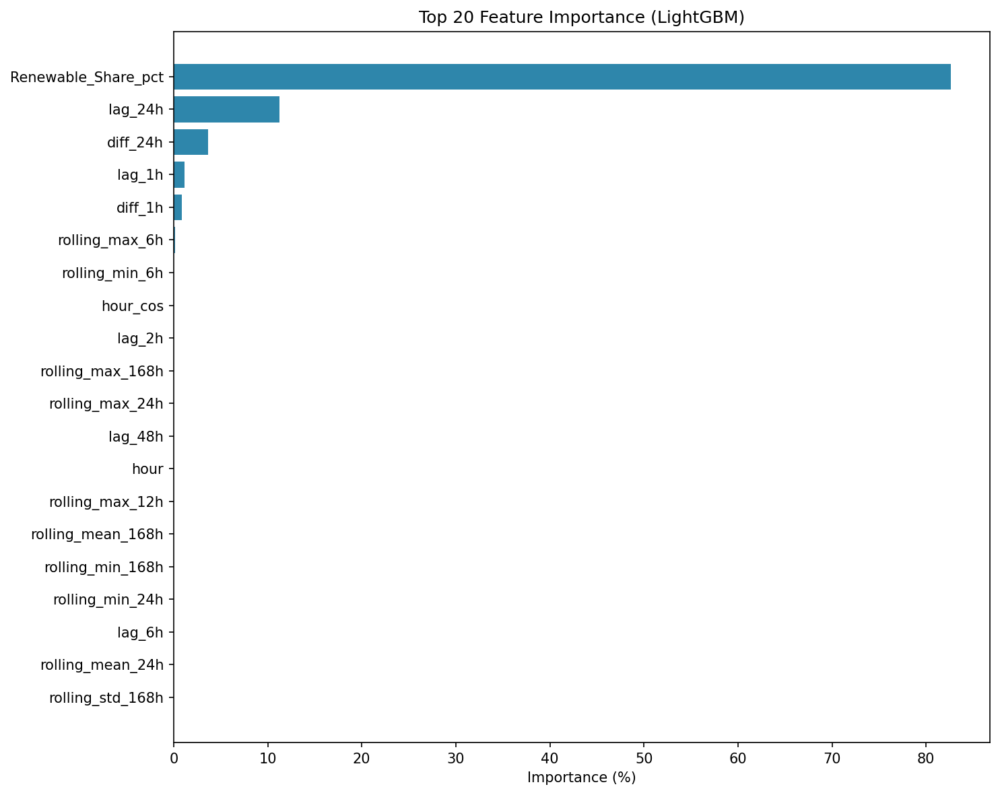
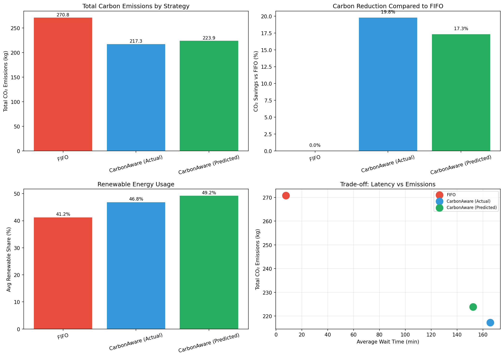
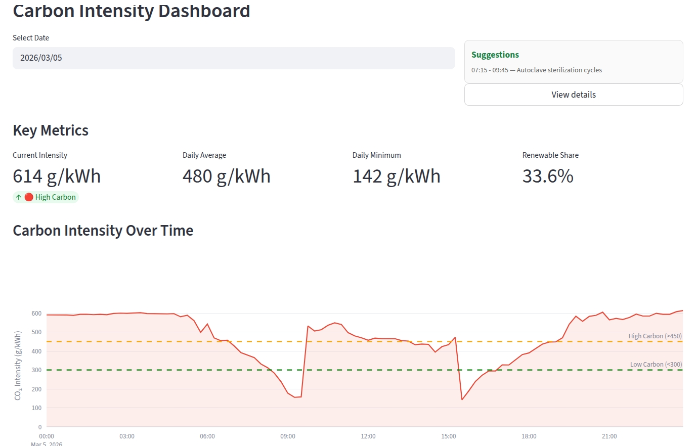

# LEAF: Lightweight Eco‑Aware Framework

LEAF is a lightweight and fully reproducible framework for **carbon‑intensity forecasting** and **carbon‑aware scheduling** of lab activities and compute jobs.

It is built entirely on open data and open‑source tools, and is designed to:

- use **transparent, lightweight ML** instead of heavy black‑box models,
- support **energy‑ and CO₂‑aware planning** of jobs under practical constraints,
- run fully on‑premise, in line with **digital sovereignty** and **Green AI** goals.

---

## 1. Architecture at a Glance

High‑level pipeline:

```text
SMARD raw data (TransnetBW, 15 min)
        │
        ▼
Preprocessing (UBA emission factors)
        │
        ├── Production-based CO₂ intensity (g/kWh)
        ▼
Forecasting (LightGBM + baselines)
        │
        └── Predicted CO₂ intensity (15 min)
        ▼
Scheduling (FIFO / EDF / Carbon-Aware)
        │
        └── Lab & compute job schedules
        ▼
Evaluation + Streamlit dashboard
```

Main components:

- `leaf/data`: SMARD parsing, CO₂ calculation, feature engineering
- `leaf/forecast`: baseline models and LightGBM regressor
- `leaf/scheduler`: task model, FIFO/EDF/Carbon‑Aware strategies, evaluation
- `scripts/`: end‑to‑end pipelines (preprocess, train, schedule)
- `app/`: Streamlit dashboard and smart suggestions

For detailed preprocessing and experiment notes, see:

- `docs/data_preprocessing_report.md`
- `docs/experiment_log.md`

---

## 2. Data and CO₂ Intensity

**Data source**

- [2] SMARD (Strommarktdaten), Bundesnetzagentur  
- Control area: [3] TransnetBW (Germany)  
- Resolution: 15‑minute intervals  
- Time range: 2024‑03‑02 – 2026‑03‑08

**CO₂ intensity**

- Production‑based carbon intensity for each 15‑minute slot
- Technology‑specific emission factors from [1] Umweltbundesamt (UBA, 2023) for:
  - hard coal, natural gas, other conventional sources
  - renewables (wind, solar, hydro, biomass) treated as zero operational emissions

This step is implemented in:

- `leaf/data/preprocessor.py`
- `scripts/process_raw_data.py`

and documented in `docs/data_preprocessing_report.md`.

---

## 3. Forecasting Carbon Intensity

**Target**

- `CO2_Intensity_gkWh` at 15‑minute resolution

**Features**

- calendar features (hour, day of week, month, weekend)
- cyclic encodings (sin/cos)
- lagged values (1–168 hours)
- rolling statistics (6, 12, 24, 168 hours)
- simple differences (1h, 24h)

Implemented in:

- `leaf/data/features.py`

**Models**

- baselines: Naive(t‑1h), Seasonal Naive(t‑24h), Moving Average(24h), Hourly Mean
- main model: LightGBM regressor (small, tree‑based, easily interpretable)

On the 2026‑03‑02 – 2026‑03‑08 test window, the LightGBM model significantly outperforms all baselines. Example metrics (test set):

| Model | MAE (g/kWh) | RMSE (g/kWh) | MAPE (%) | R² |
|-------|-------------|--------------|----------|-----|
| Naive (t‑1h) | 65.33 | 99.83 | 21.14 | 0.48 |
| Seasonal Naive (t‑24h) | 91.99 | 134.32 | 24.97 | 0.06 |
| Moving Average (24h) | 106.70 | 132.32 | 32.26 | 0.09 |
| Hourly Mean | 101.64 | 139.69 | 28.82 | −0.02 |
| **LightGBM** | **42.83** | **52.80** | **11.25** | **0.85** |

*Generated by `scripts/train_forecast.py`; full logs in `docs/experiment_log.md`.*

**Forecast vs actual (test period)**



*LightGBM predicted CO₂ intensity vs actual on the test set. Generated by `scripts/train_forecast.py`.*

**Feature importance**



*Top features for the LightGBM model. Generated by `scripts/train_forecast.py`.*

Training and evaluation pipeline:

- `scripts/train_forecast.py`
- logs and exact metrics in `docs/experiment_log.md`

---

## 4. Carbon‑Aware Scheduling

**Job model**

- defined in `data/sample/jobs_pro_2026.csv` and `leaf/scheduler/task.py`
- covers:
  - `type`: `Lab_Activity`, `AI_Training`, `Data_Process`
  - `resource`: `Lab_Bench`, `GPU`, `CPU_Pool`
  - `arrival`, `deadline`, `duration` (15‑minute multiples)
  - `power_avg` (kW), `demand` (capacity units), `priority`

**Strategies** (`leaf/scheduler/strategies.py`)

- FIFO: schedule in arrival order at earliest feasible time
- EDF: earliest deadline first
- Carbon‑Aware (two‑phase):
  1. build a feasible FIFO schedule,
  2. locally shift tasks to lower‑carbon slots within their slack, with:
     - maximum shift horizon,
     - capacity and deadline constraints,
     - a delay penalty to balance CO₂ reduction vs waiting time.

**Evaluation** (`leaf/scheduler/evaluator.py`)

- total energy (kWh)
- total emissions (g CO₂)
- average CO₂ intensity (g/kWh)
- average renewable share (%)
- average wait and tardiness (minutes)
- deadline violation rate

**Key result (example configuration)**

For the job set in early March 2026, evaluated against actual CO₂ intensity:

| Strategy | Total CO₂ (kg) | Avg CO₂ (g/kWh) | Renewable share (%) | CO₂ saved vs FIFO |
|----------|----------------|-----------------|----------------------|-------------------|
| FIFO | 270.81 | 413.5 | 41.2 | — |
| Carbon‑Aware (actual CO₂) | 217.27 | 331.7 | 46.8 | **19.8%** |
| Carbon‑Aware (predicted CO₂) | 223.89 | 341.8 | 49.2 | **17.3%** (~88% of max) |

*Source: `data/processed/schedule_comparison_with_forecast.csv` (after running `scripts/run_scheduler_with_forecast.py`).*

**Schedule comparison (emissions by strategy)**



*Total CO₂ emissions and savings vs FIFO. Generated by `scripts/run_scheduler_with_forecast.py`.*

Scheduling demo pipeline:

- `scripts/run_scheduler_with_forecast.py`

---

## 5. Web Dashboard (Streamlit)

The dashboard in `app/app.py` provides:

- **Dashboard**: daily CO₂ intensity and renewable share plots, key metrics
- **Suggestions box**:
  - on the main page, a compact box shows the best low‑carbon window for the selected day and one example high‑energy task (e.g. “15:00–17:00 — autoclave cycle”),
  - a “View details” button opens a dialog with more suggestions (low‑carbon windows and high‑carbon periods to avoid).
- **Task Manager**: overview of jobs by type and energy, task table, demo “add task” form
- **Results**: comparison of FIFO vs Carbon‑Aware schedules and exportable metrics

*Run `streamlit run app/app.py` and open the Dashboard to see carbon intensity curves and the Suggestions box; the Results page shows the same comparison metrics as in the table above.*



---

## 6. Installation and Usage

### 6.1 Environment

```bash
conda create -n leaf python=3.10 -y
conda activate leaf
pip install -r requirements.txt
```

### 6.2 Data Preprocessing

Process SMARD raw data into a cleaned time series with CO₂ intensity:

```bash
python scripts/process_raw_data.py
```

This reads from `data/raw/Actual_generation_202403020000_202603090000_Quarterhour.csv`
and writes `data/processed/energy_data_full.csv`.

### 6.3 Train Forecast Model

```bash
python scripts/train_forecast.py
```

Outputs:

- `models/lightgbm_co2_forecast.txt`
- `models/feature_importance.csv`
- `models/evaluation_results.csv`
- `figures/forecast_comparison.png`, `figures/feature_importance.png`, `figures/shap_summary.png`

*To have the result figures appear in this README on GitHub, keep the `figures/` directory in the repo (e.g. commit the generated PNGs).*

### 6.4 Run Scheduling Demo with Forecast

```bash
python scripts/run_scheduler_with_forecast.py
```

This computes FIFO and Carbon‑Aware schedules using both actual and predicted CO₂,
and writes comparison metrics to:

- `data/processed/schedule_comparison_with_forecast.csv`

### 6.5 Start the Dashboard

```bash
streamlit run app/app.py
```

Then open the provided URL (typically `http://localhost:8501`) in your browser.

---

## 7. Design Choices and Future Work

LEAF follows a few deliberate design choices:

- **Open and reproducible**:  
  Data sources ([2] SMARD, [1] UBA) and all code paths are transparent; no external closed APIs or proprietary ML models are required.

- **Lightweight Green AI**:  
  The main model is a compact LightGBM regressor; it is sufficient to capture most of the CO₂ dynamics while keeping training and inference costs low.

- **Digital sovereignty**:  
  The full pipeline runs locally; it can be integrated into university IT and lab infrastructures without vendor lock‑in.

Current limitations and potential extensions:

- use official SMARD day‑ahead / intraday forecasts as additional baselines and as extra features,
- implement receding‑horizon scheduling that periodically updates forecasts and re‑optimizes remaining tasks,
- compare the heuristic two‑phase scheduler to MILP formulations on smaller instances.

---

## 8. References

[1] Umweltbundesamt (2023). *Entwicklung der spezifischen Treibhausgas‑Emissionen des deutschen Strommix in den Jahren 1990–2022.*  
[2] SMARD – Strommarktdaten, Bundesnetzagentur. https://www.smard.de  
[3] TransnetBW GmbH – Control Area Data. https://www.transnetbw.de

